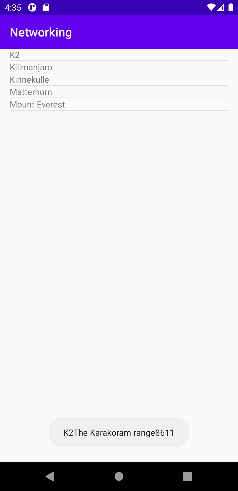
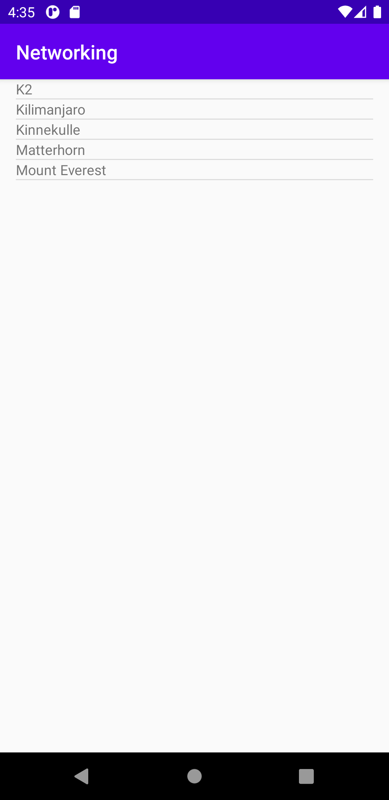

# Rapport

Denna dugga var svår. Uppgiften löstes först på ett sätt genom att hämta data och skapa en ”ny fil” i Android Studio med hjälp av att skapa en ny fil i ”assets”. 

Men under utvecklingen så ändrades metoden och istället hämtade datan från internet istället, med hjälp av en URL.


För att ha tillgång till internet lades denna kod in, i android_manifest.

```
 <uses-permission android:name="android.permission.INTERNET" />
```


För att få fram data behöver man lägga till en kodsnutt som skolan hade fixat som hette ”JsonTask”.
Sedan behövde man en till kodsnutt som för att komma åt json-webbtjänst.
För att få tillgång till data så
behövde man kopiera url koden och klistra in den. Koden placerades sedan i funktionen ”onCreate”.

```
new JsonTask().execute("https://wwwlab.iit.his.se/brom/kurser/mobilprog/dbservice/admin/getdataasjson.php?type=brom");
 ```


Man behövde skapa en ListView. Det gjordes inuti activity_main_xml, och fick en ID namn ”listView”.
Det fanns en textView innan men den togs bort. När man skapar en ListView kommer den text som finns visa sig som en ”textview.
Man måste även skapa en ”layout-XML-fil” för textview, denna TextView måste ha ett ID som sedan ska referera Java-kod.
ID blev ”list_item_textview”.

```
<ListView
    android:id="@+id/listView"
    android:layout_width="match_parent"
    android:layout_height="match_parent"
    android:text="Hello!">
</ListView>`

```

```
ListView myListView=findViewById(R.id.listView);
```

```

<?xml version="1.0" encoding="utf-8"?>
<TextView xmlns:android="http://schemas.android.com/apk/res/android"
    android:layout_width="match_parent"
    android:layout_height="match_parent"
    android:id="@+id/list_item_textview" >
</TextView>
```


Nästa steg var att skapa ArrayList<Mountain> och `ArrayAdapter<Mountain>` som medlemsvariabel i min kod.
Det skrev man in MainActivity.java. När man lägger in dem kommer de att vara röda för att ändra det måste man ”lägga in dem”.

```
private ArrayList<Mountain>  arrayMountain = new ArrayList<>();
private ArrayAdapter<Mountain> adapter;
```

I funktionen ”onCreate lägger man till denna kod snutt för att få ”tillgång” till den ny skapande ”layout-XML-fil” som
heter ”list_item_textview.” Man behöver nämna både filen och ID som i detta fall heter de samma.

```
arrayMountain=new ArrayList<>();
adapter=new ArrayAdapter<>(MainActivity.this,R.layout.list_item_textview,R.id.list_item_textview,arrayMountain);`

```


Med Json vill man ha en datastruktur, alltså en array eller listarray osv.
För att få tillgång till Gson behövde man lägga till bibliotek. Detta gjordes.

```
implementation ’com.google.code.gson:gson:2.8.6'
```


Man måste skapa en ny java class som döptes till Mountain.java pga att data:n man har fått handlar om berg, mest logiskt.
Man ska även skapa medlemsvariabel och sedan namnge dem likadant som Json egenskaperna .

```
public class Mountain {
    private String ID;
    private String name;
    private String type;
    private String company;
    private String location;
    private String category;
  ```

När man tryckte på namnen skulle man få upp ”namn, size och location” på emulatorn, för att det skulle gå
behövdes det läggas till Mounten.java klass, och sedan lades  det in ”public stings”. Det behövde även lägga till en ”toString.

```
public String getName() {
    return name;
}
public String getLocation() {
    return location;
}
public int getSize() {
    return size;
}

@Override
public String toString() {
    return name;
}

```

För att det skulle visas behövde en Toast View, där man skrev in de element som skulle visas upp som namn, storlek och plats.

```
@Override
public void onItemClick(AdapterView<?> parent, View view, int position, long id) {
    Mountain a = arrayMountain.get(position);
    a.getName();
    a.getSize();
    a.getLocation();
    String medelande = a.getName() + a.getLocation() + a.getSize();
    Toast.makeText(MainActivity.this, medelande ,  Toast.LENGTH_SHORT).show();

}
```


Denna kod stycke behövdes om/när man la till objekt i listan över bergen. Med koden skulle det meddela adaptern
att innehållet i ArrayList har uppdaterats.

```
arrayMountain.clear();
for(int i=0; i <mountains.length; i++){
    arrayMountain.add(mountains[i]);
}
adapter.notifyDataSetChanged();
```




